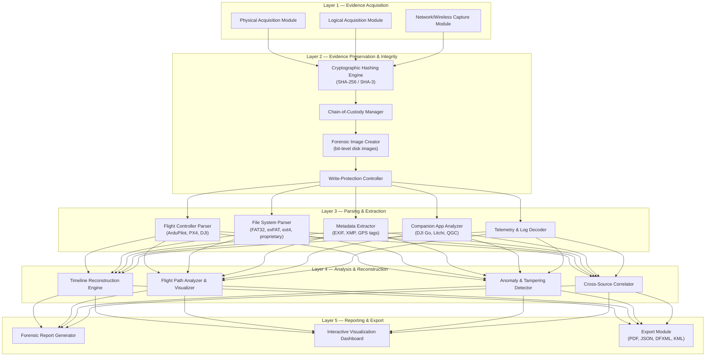
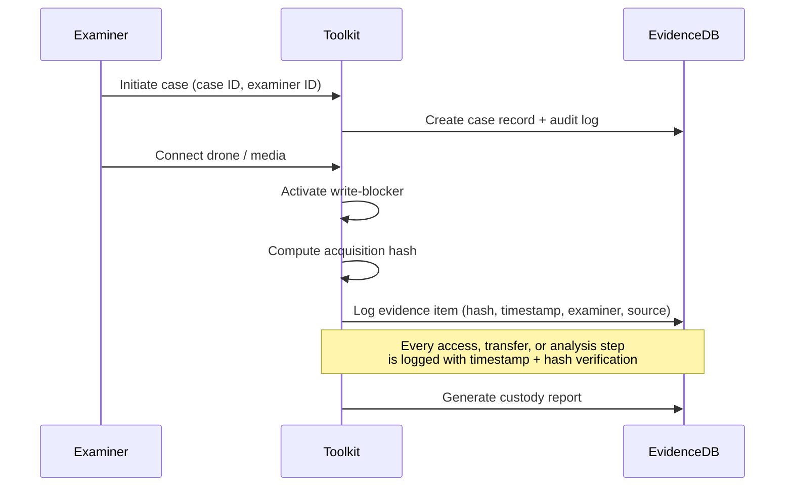
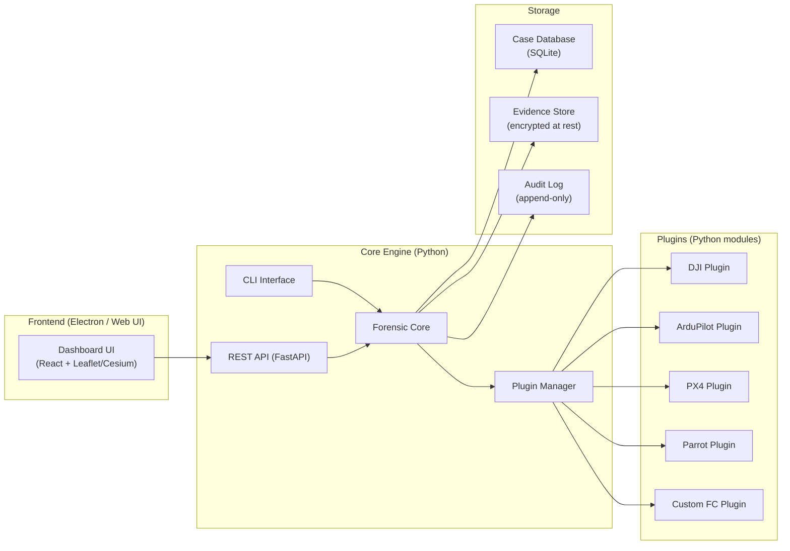
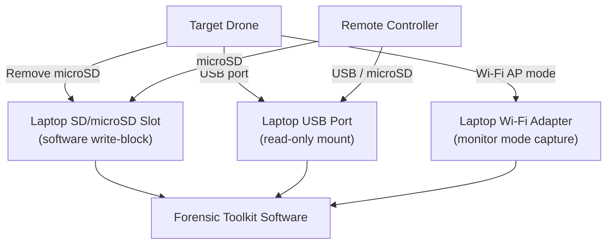
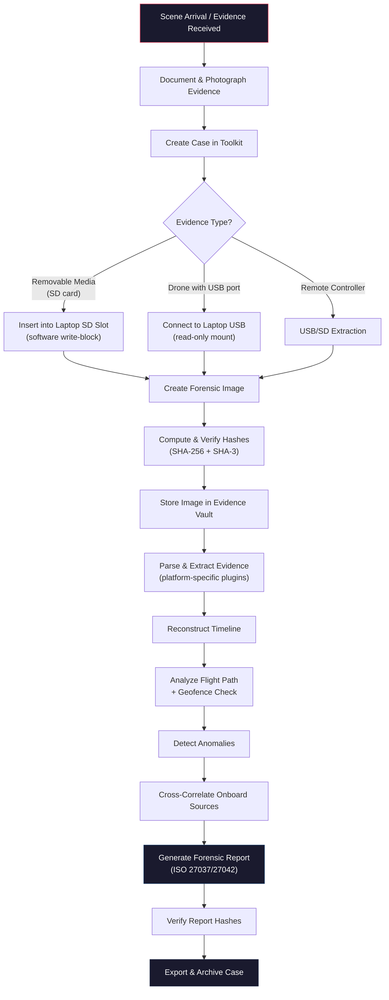

# Drone Forensic Toolkit — Stage 1 Preliminary Architecture

A proposed architecture for the IIT Bombay Techfest Grand Challenge: an indigenous, modular Drone Forensic Toolkit for forensically sound acquisition, preservation, analysis, and reporting of digital evidence from UAVs.

---

## High-Level Architecture



---

## Detailed Component Breakdown

### Layer 1 — Evidence Acquisition

This layer handles the direct interface with drone hardware and associated devices using **only the laptop's built-in ports** (USB, SD/microSD card slot). All acquisition is **read-only** with software write-blocking.

> [!NOTE]
> Stage 1 is software-only. No dedicated forensic hardware (write-blockers, JTAG adapters, SDR dongles) is required. All acquisition is performed through standard laptop interfaces.

#### Physical Acquisition Module
| Aspect | Detail |
|---|---|
| **Purpose** | Bit-level imaging of onboard storage (SD cards, USB-accessible storage) |
| **Interfaces** | Laptop USB ports, laptop built-in SD/microSD card slot |
| **Method** | Software write-blocking (OS-level mount as read-only) + `dc3dd`/`ewfacquire` for imaging |
| **Output** | Raw `.dd` / `.E01` forensic images |
| **Key Feature** | Software write-protect verification before every acquisition |

#### Logical Acquisition Module
| Aspect | Detail |
|---|---|
| **Purpose** | File-level extraction from accessible storage and mounted volumes |
| **Targets** | Flight logs, media files, configuration, firmware, databases |
| **Method** | USB Mass Storage (read-only mount), MAVLink over USB serial, MTP |
| **Output** | Structured file tree with per-file hashes |

#### Network Capture Module (Software-Based)
| Aspect | Detail |
|---|---|
| **Purpose** | Capture drone ↔ controller communication over Wi-Fi |
| **Method** | Laptop Wi-Fi adapter in monitor mode (software packet capture) |
| **Tools** | `tshark` / `pyshark` for pcap capture and dissection |
| **Output** | Time-stamped packet captures with protocol dissection |

---

### Layer 2 — Evidence Preservation & Integrity

> [!IMPORTANT]
> This layer is **critical** for legal admissibility. Every evidence artifact must have a verifiable integrity chain from acquisition to report.

#### Cryptographic Hashing Engine
- **Algorithms**: SHA-256 (primary), SHA-3-256 (secondary), MD5 (legacy compatibility)
- **Process**: Dual-hash computed at acquisition time → stored in signed hash manifest
- **Verification**: Re-hash at every processing stage; any mismatch triggers an alert and halts processing

#### Chain-of-Custody Manager


- Every action is logged with: **who**, **what**, **when**, **where**, **hash-before**, **hash-after**
- Tamper-evident audit log (append-only, HMAC-signed entries)
- Exportable as a standalone Chain-of-Custody document

#### Forensic Image Creator
- Creates bit-exact forensic images in **E01** (EnCase) and **raw/dd** formats
- Supports split images for large volumes
- Compression with integrity verification

#### Write-Protection Controller (Software-Only)
- **OS-level read-only mounting**: All removable media mounted with `mount -o ro` (Linux) or equivalent Windows read-only policies
- **Write-block verification test**: Automated check confirms no write access before every acquisition (attempts a test write to a temp sector → must fail)
- **Audit logging**: Every mount/unmount event is logged with timestamps and verification results

---

### Layer 3 — Parsing & Extraction

This is where the **vendor-specific intelligence** resides. Each parser is a **plugin** loaded based on the detected drone platform.

#### Supported UAV Platforms (Initial)

| Platform | Flight Controller | Log Format | Storage |
|---|---|---|---|
| DJI Mavic / Phantom / Mini series | DJI proprietary FC | `.DAT`, `.txt` (DJI flight records) | eMMC, microSD |
| ArduPilot-based (Pixhawk, Cube) | ArduPilot | `.bin`, `.log` (DataFlash), `.tlog` (MAVLink) | microSD, flash |
| PX4-based drones | PX4 Autopilot | `.ulg` (ULog) | microSD |
| Parrot (Anafi, Bebop) | Parrot proprietary | `.pud`, JSON logs | Internal flash, microSD |
| Custom/hobby (Betaflight, iNav) | STM32 FC | `.bbl` (Blackbox) | Flash, microSD |

#### Flight Controller Parser
- **Plugin architecture**: Each drone family has a dedicated parser module
- **Extracts**: GPS waypoints, altitude, speed, heading, battery voltage, motor RPM, RC inputs, sensor data, error codes, arming/disarming events
- **Key parsers**:
  - `DJIParser` — Decodes `.DAT` files (encrypted on newer models; supports known decryption methods)
  - `ArduPilotParser` — Parses DataFlash `.bin`/`.log` and MAVLink `.tlog`
  - `PX4Parser` — Decodes ULog `.ulg` format
  - `ParrotParser` — Parses `.pud` flight data
  - `BlackboxParser` — Decodes Betaflight/iNav blackbox logs

#### File System Parser
- **Supported FS**: FAT32, exFAT, ext4, YAFFS2 (NAND), proprietary DJI partitions
- Carves deleted files from unallocated space
- Recovers fragmented media files (JPEG, MP4, H.264/H.265)

#### Metadata Extractor
- **Photo/Video**: EXIF (GPS, timestamp, camera model, settings), XMP, IPTC
- **Firmware**: Version, build date, serial number, configuration parameters
- **Onboard databases**: SQLite databases found on drone storage (cached waypoint missions, settings)

#### Telemetry & Log Decoder
- Decodes MAVLink v1/v2 protocol messages
- Parses SRT subtitle files from DJI video (embedded telemetry)
- Extracts sensor fusion data (IMU, barometer, magnetometer, GPS)

> [!NOTE]
> **Companion app forensics** (DJI Go, Litchi, QGroundControl phone data) is intentionally **de-scoped for Stage 1**. The focus is on onboard drone evidence. Companion app analysis will be added in Stage 2 if needed.

---

### Layer 4 — Analysis & Reconstruction

#### Timeline Reconstruction Engine

```mermaid
gantt
    title Example: Reconstructed Drone Flight Timeline
    dateFormat HH:mm:ss
    axisFormat %H:%M:%S

    section System Events
    Power On           :e1, 10:00:00, 30s
    GPS Lock           :e2, after e1, 45s
    Arming             :e3, after e2, 10s

    section Flight
    Takeoff            :f1, after e3, 15s
    Waypoint Navigation:f2, after f1, 300s
    Hover (Recording)  :f3, after f2, 120s
    Return to Home     :f4, after f3, 180s
    Landing            :f5, after f4, 15s

    section Media
    Video Recording    :m1, after f1, 420s
    Photo Capture x3   :m2, after f2, 30s

    section Anomalies
    Signal Loss Event  :crit, a1, after f2, 10s
```


- Merges events from **all evidence sources** (flight logs, media timestamps, app logs, packet captures) into a unified, sortable timeline
- Correlates events across sources (e.g., GPS position at time of photo capture)
- Highlights gaps, inconsistencies, or anomalies

#### Flight Path Analyzer & Visualizer
- Renders 3D/2D flight path on map (OpenStreetMap / satellite imagery)
- Exports to **KML/KMZ** (Google Earth compatible)
- Calculates: total distance, max altitude, speed profile
- Overlays media capture points on the flight path

##### Investigator-Configurable Geofence Zones
The toolkit allows the forensic investigator to **define custom geofence zones** and check whether the drone violated them:

| Feature | Detail |
|---|---|
| **Define zones** | Draw polygon / circle geofences on the map UI, or import from GeoJSON/KML |
| **Preset zones** | Load restricted airspace boundaries (airports, military, no-fly zones) from a bundled database |
| **Violation detection** | Automatically flag every GPS point where the drone entered/exited a defined zone |
| **Altitude fences** | Set max altitude thresholds; flag breaches |
| **Time-based fences** | Restrict analysis to specific time windows (e.g., "was the drone in Zone A between 14:00–15:00?") |
| **Report integration** | Geofence violations appear as flagged events in the timeline and forensic report |

This is an **analysis tool for the investigator**, not a real-time enforcement mechanism — it answers the question: *"Did this drone enter restricted or suspicious areas during its flight?"*

#### Anomaly & Tampering Detector
- Detects log gaps, timestamp discontinuities, hash mismatches
- Identifies signs of log deletion or modification
- Flags firmware modifications or jailbreaking indicators
- GPS spoofing detection (consistency checks against barometric altitude, IMU data)

#### Cross-Source Correlator
- Links evidence across sources: e.g., "photo taken at GPS coordinate X matches flight log position at time T"
- Correlates controller inputs (from RC log data on SD) with drone behavior
- Cross-references multiple onboard evidence sources (flight log vs. media timestamps vs. telemetry)

---

### Layer 5 — Reporting & Export

#### Forensic Report Generator
- Generates **court-admissible forensic reports** following standard templates
- Report sections: Case info, evidence inventory, acquisition methodology, hash verification, findings, timeline, flight path, conclusions
- Supports customizable templates
- Includes examiner certification and digital signature

#### Export Formats
| Format | Purpose |
|---|---|
| **PDF** | Formal forensic report with embedded images/maps |
| **JSON/XML** | Machine-readable structured evidence data |
| **DFXML** | Digital Forensics XML (standard interchange format) |
| **KML/KMZ** | Flight path visualization in Google Earth |
| **CSV** | Tabular log data for external analysis |
| **HTML** | Interactive web-based report with embedded maps |

#### Interactive Visualization Dashboard
- Web-based UI (Electron or browser-based)
- Real-time evidence browsing, timeline scrubbing, flight path replay
- Search and filter across all extracted evidence
- Case management: multi-case support, examiner roles

---

## Software Architecture



### Technology Stack

| Component | Technology | Rationale |
|---|---|---|
| **Core engine** | Python 3.11+ | Rich forensics ecosystem, rapid prototyping, cross-platform |
| **CLI** | Click / Typer | Professional CLI with subcommands |
| **API server** | FastAPI | Async, OpenAPI docs, easy frontend integration |
| **Frontend** | Electron + React | Cross-platform desktop app, rich visualization |
| **Maps** | Leaflet.js + Cesium.js | 2D/3D flight path visualization |
| **Database** | SQLite | Portable, no server needed, forensic-standard |
| **Hashing** | hashlib (Python) + hardware acceleration | SHA-256, SHA-3, MD5 |
| **Disk imaging** | `dc3dd` / `ewfacquire` (integration) | Forensic-grade imaging tools |
| **File carving** | Scalpel / PhotoRec (integration) | Deleted file recovery |
| **Report generation** | Jinja2 + WeasyPrint | Templated PDF reports |
| **Packaging** | PyInstaller / Docker | Single-binary distribution |

---

## Acquisition Interfaces (Software-Only, Laptop Ports)

Stage 1 uses **only the laptop's built-in ports** — no dedicated forensic hardware required.



### Laptop Port Usage
| Laptop Port | Evidence Source | Acquisition Method |
|---|---|---|
| **SD/microSD slot** | Drone SD card, RC SD card | Read-only mount → forensic image (`dc3dd`) |
| **USB port** | Drone USB debug, RC USB, flight controller serial | Read-only mount or MAVLink serial protocol |
| **Wi-Fi adapter** | Drone Wi-Fi AP traffic | Monitor mode packet capture (`tshark`) |

> [!TIP]
> Dedicated hardware (JTAG adapters, forensic write-blockers, SDR dongles) can be integrated in **Stage 2** when the prototype budget is available. The software architecture is designed to support these interfaces with minimal changes.

### Stage 2 Hardware Kit (Planned)

The following hardware will extend acquisition capabilities beyond laptop ports when Stage 2 funding (₹1 lakh) is available:

| Item | Purpose | Est. Cost (INR) |
|---|---|---|
| USB write-blocker (Tableau T8u or equivalent) | Prevent evidence tampering during USB acquisition | ₹15,000–30,000 |
| Multi-format card reader with write-block | SD/microSD/CF forensic reads | ₹5,000–10,000 |
| FTDI UART adapter | Serial console access to flight controllers | ₹500–1,000 |
| JTAG/SWD debugger (ST-Link V2, J-Link) | Flash memory readout from onboard eMMC/NAND | ₹2,000–5,000 |
| SPI flash reader (CH341A) | Chip-off acquisition for soldered flash | ₹500–1,000 |
| RTL-SDR dongle | RF signal capture (telemetry, video downlink) | ₹2,000–3,000 |
| **Estimated Total** | | **₹25,500–50,000** |

---

## Forensic Methodology & Workflow



---

## Evidence Preservation & Chain-of-Custody Methodology

### Hash Manifest Structure
```json
{
  "case_id": "CASE-2026-001",
  "examiner": "Forensic Analyst Name",
  "acquisition_timestamp": "2026-09-13T12:00:00Z",
  "evidence_items": [
    {
      "item_id": "EV-001",
      "description": "DJI Mavic 3 microSD card - 64GB",
      "source": "Physical acquisition via write-blocked reader",
      "image_file": "EV-001.E01",
      "hashes": {
        "sha256": "a1b2c3d4e5f6...",
        "sha3_256": "f6e5d4c3b2a1...",
        "md5": "abc123def456..."
      },
      "verification_history": [
        {
          "stage": "acquisition",
          "timestamp": "2026-09-13T12:05:00Z",
          "sha256_match": true
        },
        {
          "stage": "parsing",
          "timestamp": "2026-09-13T12:30:00Z",
          "sha256_match": true
        }
      ]
    }
  ]
}
```

---

## Risk Assessment

| Risk | Impact | Likelihood | Mitigation |
|---|---|---|---|
| Encrypted storage (DJI newer models) | Cannot extract flight data | High | Support known decryption methods; document limitations; plan hardware-based extraction for Stage 2 |
| Proprietary/undocumented log formats | Incomplete parsing | Medium | Reverse-engineering effort; community tool integration (DatCon, DJI Flight Log Viewer); extensible plugin system |
| Software write-block bypass | Evidence integrity compromised | Low | Multi-layer verification (OS-level + application-level); automated write-test before acquisition; dual-hash at acquisition |
| Volatile memory loss on power-off | Lost RAM-resident data | High | Document limitation; prioritize powered-on USB acquisition when safe |
| No JTAG/chip-off capability (Stage 1) | Limited to accessible storage | Medium | Focus on SD card and USB-accessible evidence; document as limitation; add hardware interfaces in Stage 2 |
| Diverse drone platforms | Incomplete coverage | Low | All 5 major platforms supported from Day 1 via plugin architecture |
| Legal admissibility challenges | Report rejected in court | Medium | Follow ISO/IEC 27037:2012 and ISO/IEC 27042:2015; standardized reporting templates |

---

## Validation Methodology

### Unit-Level Validation
- Each parser plugin tested against known-good log files from each supported platform
- Hash engine verified against NIST test vectors
- File carving validated against planted test files on formatted media

### Integration Testing
- End-to-end workflow: acquisition → parsing → analysis → report for each supported drone
- Chain-of-custody verification across full pipeline
- Cross-source correlation accuracy tests

### Controlled Test Scenarios
| Scenario | Validation Goal |
|---|---|
| Normal flight with DJI Mavic | Full pipeline: logs, media, GPS, timeline, report |
| ArduPilot drone with waypoint mission | MAVLink parsing, waypoint extraction, flight path |
| SD card with deleted photos | File carving, metadata recovery |
| Tampered/modified log file | Anomaly detection, hash mismatch alert |
| Multi-source onboard correlation | Flight log + media metadata + telemetry → unified timeline |
| Encrypted DJI storage | Limitations documentation, partial extraction |
| Geofence violation detection | Define zones → import flight → verify breach flagging accuracy |
| PX4 ULog parsing | Full pipeline with PX4 `.ulg` logs |
| Betaflight/iNav blackbox | Blackbox `.bbl` decode, flight path, timeline |

### Standards Compliance (ISO-Based)
- **ISO/IEC 27037:2012** — Guidelines for identification, collection, acquisition and preservation of digital evidence *(primary framework)*
- **ISO/IEC 27042:2015** — Guidelines for the analysis and interpretation of digital evidence *(reporting and analysis methodology)*
- **ISO/IEC 27041:2015** — Guidance on assuring suitability and adequacy of incident investigative method
- **NIST SP 800-86** — Guide to Integrating Forensic Techniques into Incident Response *(supplementary reference)*
- **SWGDE Best Practices** — Scientific Working Group on Digital Evidence

---

## Extensibility Strategy

The plugin architecture ensures new drone platforms can be added with **minimal core changes**:

```python
# Example: Adding a new drone platform plugin
class NewDronePlugin(DroneForensicPlugin):
    """Plugin interface — implement these methods to add a new platform."""

    platform_name = "NewDrone X500"
    supported_log_formats = [".nlog", ".ndat"]

    def detect(self, evidence_path: str) -> bool:
        """Auto-detect if evidence belongs to this platform."""
        ...

    def parse_flight_logs(self, log_path: str) -> FlightData:
        """Parse proprietary flight logs into standard FlightData."""
        ...

    def extract_telemetry(self, log_path: str) -> TelemetryStream:
        """Extract telemetry data (GPS, IMU, battery, etc.)."""
        ...

    def extract_media_metadata(self, media_path: str) -> MediaMetadata:
        """Extract metadata from captured photos/videos."""
        ...
```

New plugins are **auto-discovered** at startup — drop a Python module into the `plugins/` directory and it's available.

---

## Design Decisions (Resolved)

| Decision | Resolution |
|---|---|
| **Drone platform scope** | All 5 platforms from Day 1: DJI, ArduPilot, PX4, Parrot, Betaflight/iNav |
| **Hardware vs. software** | Stage 1 is software-only; uses laptop USB + SD ports; dedicated hardware planned for Stage 2 |
| **Companion app forensics** | De-scoped for Stage 1; focus is on onboard drone evidence |
| **Reporting standards** | ISO/IEC 27037:2012 and ISO/IEC 27042:2015 as primary frameworks |
| **Geofencing** | Investigator-configurable geofence zones (draw, import, altitude/time fences) |
