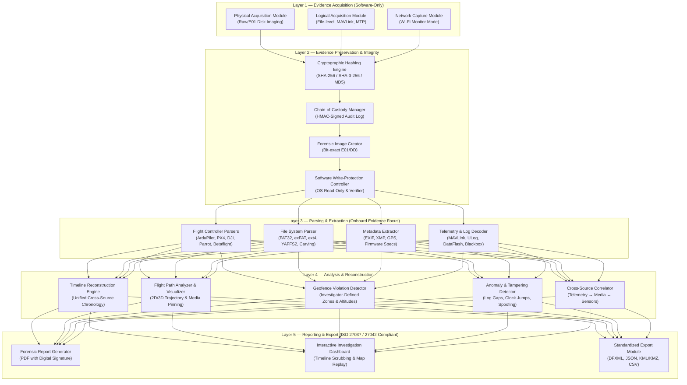
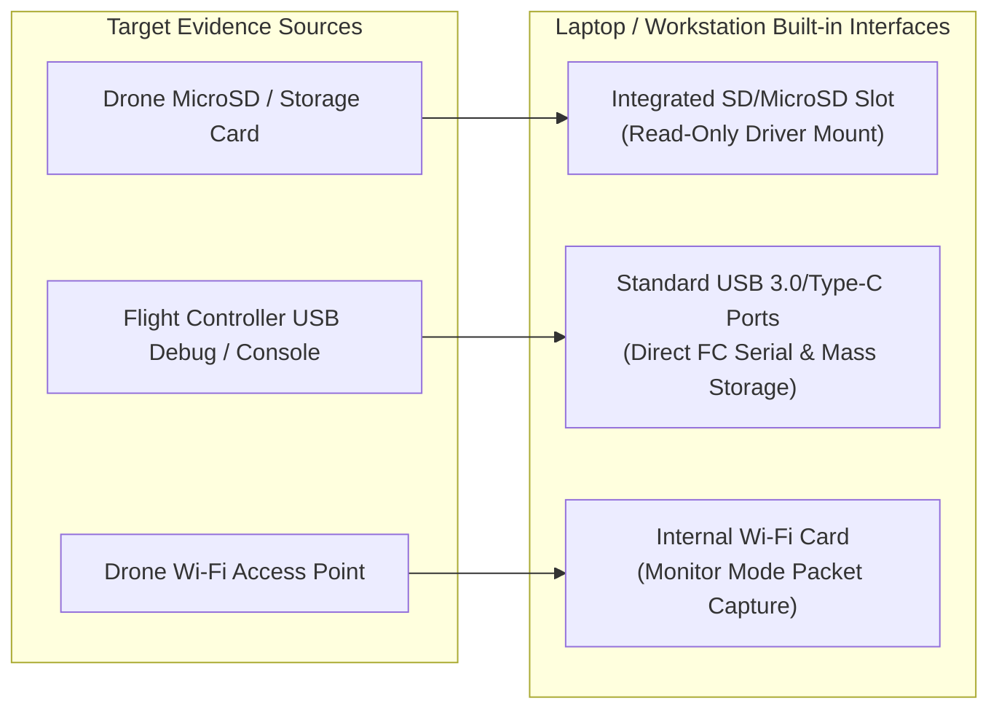
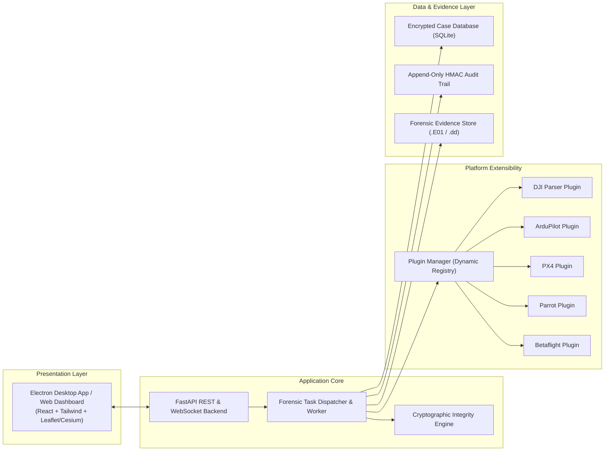

# Drone Forensic Toolkit — Stage 1 Preliminary Design & Architecture Proposal
**IIT Bombay Techfest Grand Challenge: Objective 1 — Drone Forensics Toolkit Development**

---

## Executive Summary

This document presents the preliminary design and architecture for the **Drone Forensic Toolkit (DFT)**, an indigenous, vendor-independent, and extensible digital forensics solution designed to acquire, preserve, analyze, and report digital evidence from Unmanned Aerial Vehicles (UAVs) in a forensically sound and legally defensible manner.

In accordance with Stage 1 guidelines:
- **Scope**: Software-only solution utilizing standard forensic workstation / laptop ports (USB, SD/microSD, Wi-Fi monitor mode).
- **Target Platforms**: Comprehensive coverage from Day 1 across commercial, open-source, and DIY platforms (DJI, ArduPilot, PX4, Parrot, Betaflight/iNav).
- **Evidence Focus**: Onboard storage and flight controller telemetry/logs.
- **Integrity & Standards**: Dual cryptographic hashing (SHA-256 / SHA-3), tamper-evident audit logging, and compliance with **ISO/IEC 27037:2012** (Digital Evidence Handling) and **ISO/IEC 27042:2015** (Analysis and Interpretation).
- **Analysis Capabilities**: Multi-source timeline reconstruction, 2D/3D flight path visualization, anomaly/tampering detection, and investigator-configurable geofencing.

---

## 1. High-Level 5-Layer Architecture



---

## 2. Layer-by-Layer Detailed Breakdown

### Layer 1: Evidence Acquisition (Software-Only)
All data acquisition is performed using standard laptop/workstation built-in ports without requiring external proprietary hardware:

* **Physical Acquisition Module**:
  * Bit-level physical disk imaging of removable storage (microSD/SD) and direct USB mass storage.
  * Generates industry-standard raw (`.dd`/`.raw`) and Expert Witness Format (`.E01`) forensic containers.
  * Integrated software write-block verification prior to initiating imaging operations.
* **Logical Acquisition Module**:
  * File-level extraction from mounted read-only filesystems.
  * Direct communication with flight controllers over USB virtual COM ports using protocol abstraction (MAVLink streams for ArduPilot/PX4, CLI dumps for Betaflight).
  * Media and system log extraction from onboard MTP/PTP storage.
* **Network Capture Module**:
  * Utilizes the host machine's wireless interface in monitor mode to capture 802.11 management/data frames between UAV and controller when direct physical connection is restricted.

### Layer 2: Evidence Preservation & Integrity
* **Dual-Hash Engine**: Computes SHA-256 (primary legal standard) and SHA-3-256 (collision-resistant next-generation hash) simultaneously during streaming read/write, with optional MD5 legacy logging.
* **Chain-of-Custody (CoC) Manager**: Tamper-evident, append-only SQLite store with HMAC-SHA256 digital signatures for each action. Records examiner ID, case ID, acquisition source, serial numbers, timestamps, and stage hashes.
* **Software Write-Protection Controller**: 
  * Enforces read-only loop mounts and OS policy overrides.
  * Performs active write-inhibition verification by attempting canary sector writes to a scratch memory block to guarantee physical media cannot be modified.

### Layer 3: Parsing & Extraction (Onboard Evidence Focus)
* **Supported UAV Platforms**:
  | Platform Family | Flight Controllers | Primary Log Formats | Typical Storage Media |
  |---|---|---|---|
  | **DJI Series** (Mavic, Mini, Phantom) | DJI Proprietary | `.DAT` (Fly Records), `.txt`, SRT Subtitles | eMMC, MicroSD |
  | **ArduPilot** (Pixhawk, Cube, Mission Planner) | STM32 / Linux SoC | `.bin`, `.log` (DataFlash), `.tlog` (MAVLink) | MicroSD, Onboard Flash |
  | **PX4 Autopilot** (PX4 / QGC ecosystem) | Pixhawk FMUvX | `.ulg` (ULog binary format) | MicroSD |
  | **Parrot** (Anafi, Bebop) | Parrot SoC | `.pud`, JSON flight logs | Internal Flash, MicroSD |
  | **Betaflight / iNav** (FPV / Custom Drones) | STM32 F4/F7/H7 | `.bbl` (Blackbox logs), CLI config dumps | Onboard SPI Flash, MicroSD |
* **File Carving & Media Recovery**: Carves orphaned JPEG, MP4, H.264/H.265 video streams and deleted flight logs from unallocated sectors.
* **Metadata Extraction**: Decodes EXIF GPS tags, camera focal parameters, gimbal pitch/yaw, and sensor telemetry embedded in video subtitle (SRT) streams.

### Layer 4: Analysis & Reconstruction
* **Timeline Reconstruction Engine**: Aggregates disparate asynchronous events (boot, sensor calibration, arming, GPS lock, takeoff, waypoint triggers, photo/video captures, failsafe triggers, disarm) into a single chronological matrix normalized to UTC.
* **Flight Path Analyzer**:
  * 3D/2D flight path reconstruction and playback with velocity, altitude, and heading vectors.
  * Exportable to KML/KMZ for high-resolution geospatial inspection in Google Earth.
* **Investigator-Configurable Geofence Zones**:
  * **Custom Geofence Definition**: Investigator can draw polygons/circles directly on the map UI or import boundaries via GeoJSON/KML.
  * **Pre-configured No-Fly Zones**: Integrated database of airport exclusion zones and sensitive infrastructure coordinates.
  * **Breach Detection**: Flags timestamps, altitudes, and coordinates of boundary infringements.
  * **Temporal & Altitude Filters**: Evaluates whether a UAV operated within a restricted volume during a specific timeframe.
* **Anomaly & Anti-Forensic Detection**:
  * Identification of log gaps, clock skew/drift, missing sequence numbers, and suspicious formatting.
  * Detection of GPS spoofing via sensor discordance (barometric altitude vs. GPS ellipsoidal height vs. accelerometer Z-axis integration).

### Layer 5: Reporting & Export
* **Court-Admissible Forensic Reports**: Structured according to **ISO/IEC 27037** and **ISO/IEC 27042**, including case summary, itemized evidence logs, verified hash integrity histories, examiner notes, and visual trajectory appendices.
* **Multi-Format Export**: Generates signed PDF reports, standard Digital Forensics XML (DFXML), GeoJSON, and machine-readable JSON payloads for cross-agency sharing.

---

## 3. Hardware Acquisition Interfaces

### Stage 1: Software-Only Laptop Port Utilization


### Stage 2 Planned Hardware Kit (Prototype Expansion)
When Stage 2 funding (Rs. 1 Lakh) is unlocked, hardware capabilities will be expanded to encompass chip-off and RF spectrum acquisition:

| Hardware Module | Forensic Purpose | Estimated Cost (INR) |
|---|---|---|
| **Hardware USB Write-Blocker** | Physical hardware-level write inhibition for USB mass storage | ₹15,000 – ₹30,000 |
| **Forensic Multi-Card Reader** | Write-blocked acquisition of SD/microSD/CompactFlash media | ₹5,000 – ₹10,000 |
| **FTDI Multi-Voltage UART Adapter** | Direct serial console debugging on flight controllers without USB ports | ₹500 – ₹1,000 |
| **JTAG / SWD In-Circuit Debugger** | Direct flash memory readout from locked or unbootable MCUs | ₹2,000 – ₹5,000 |
| **SPI / I2C Flash Programmer** | Chip-off acquisition of desoldered flash memory chips | ₹500 – ₹1,000 |
| **Software-Defined Radio (RTL-SDR)** | RF signal logging (telemetry bands, video downlinks, C2 links) | ₹2,000 – ₹3,000 |
| **Total Hardware Estimate** | | **₹25,000 – ₹50,000** |

---

## 4. Software Architecture & Technology Stack



* **Core Engine**: Python 3.11+ (asynchronous, robust forensics ecosystem).
* **CLI & Automation**: Click / Typer for headless batch scripting and scripted acquisition.
* **API Backend**: FastAPI for modular decoupled client-server architecture.
* **Visualization Dashboard**: React + Leaflet / Cesium.js for interactive 2D geospatial tracks, 3D attitude playback, and synchronized timeline scrubbing.
* **Storage & Indexing**: SQLite with SQLCipher for encrypted forensic case indexes and metadata.
* **Report Engine**: Jinja2 templating with WeasyPrint / headless Chromium PDF renderer.

---

## 5. Extensibility Framework (Plugin Architecture)

To ensure vendor neutrality and ease of onboarding new UAV hardware, parser logic is abstracted behind a standardized Python interface:

```python
from abc import ABC, abstractmethod
from typing import Dict, Any, List
from dataclasses import dataclass

@dataclass
class TelemetryPoint:
    timestamp_utc: str
    latitude: float
    longitude: float
    altitude_m: float
    ground_speed_mps: float
    pitch: float
    roll: float
    yaw: float
    battery_pct: float

class DroneForensicPlugin(ABC):
    @property
    @abstractmethod
    def platform_id(self) -> str:
        """Unique identifier for the drone platform."""
        pass

    @abstractmethod
    def detect(self, evidence_root: str) -> bool:
        """Autonomously signatures the evidence directory/image."""
        pass

    @abstractmethod
    def parse_flight_logs(self, log_path: str) -> List[TelemetryPoint]:
        """Parses telemetry points into the standardized telemetry schema."""
        pass

    @abstractmethod
    def extract_system_events(self, log_path: str) -> List[Dict[str, Any]]:
        """Extracts arming, disarming, failsafe, and error events."""
        pass
```

New drone platforms are added simply by placing a new Python file in the `plugins/` directory; the toolkit auto-discovers and registers the plugin dynamically at runtime.

---

## 6. Risk Assessment & Mitigation Strategy

| Risk Identified | Severity | Likelihood | Technical Mitigation Strategy |
|---|---|---|---|
| **Encrypted DJI Onboard Logs** | High | High | Implement decryption routines using known device keys; extract unencrypted video subtitle telemetry (SRT); document boundaries transparently. |
| **Proprietary / Undocumented Binary Logs** | Medium | Medium | Leverage proven open-source reversing utilities (DatCon, pyulog, pymavlink); modular plugin isolation prevents parser failures from halting ingestion. |
| **Accidental In-Place Modification of Media** | Critical | Low | Two-stage software write-block verification: enforcing read-only loopback mount policies + canary write check prior to block reading. |
| **Volatile Flight Log Erasure upon Power Down** | High | Medium | Provide guidance protocols for live-system acquisition when flight controller is powered; fallback to onboard non-volatile SPI flash dumps. |
| **Geofencing / Map Drift Errors** | Low | Medium | Utilize WGS-84 coordinate standard throughout; calculate spatial projections using GDAL/Shapely libraries to guarantee geodetic precision. |
| **Legal Admissibility Rejection in Court** | High | Low | Rigorous adherence to ISO/IEC 27037 and ISO/IEC 27042 standards; continuous hash validation at every stage with HMAC-signed audit trails. |

---

## 7. Validation & Verification Methodology

1. **NIST Reference Testing**: Validate cryptographic routines against NIST CAVP test vectors for SHA-256 and SHA-3.
2. **Synthetic Tampering Tests**: Inject artificial timestamp gaps and corrupted coordinate spikes into DataFlash and ULog files to verify anomaly detection sensitivity.
3. **Controlled Flight Simulation Scenarios**:
   * *Scenario A (DJI Mini/Mavic)*: Extraction of flight records, video metadata, and waypoint tracks.
   * *Scenario B (Pixhawk / ArduPilot)*: Autonomous mission parsing, MAVLink log decoding, and geofence breach detection against custom polygons.
   * *Scenario C (PX4 Autopilot)*: ULog analysis, sensor diagnostics, and failsafe trigger validation.
   * *Scenario D (Betaflight FPV)*: Blackbox log decoding, motor RPM, and stick inputs reconstruction.
4. **Geofence Accuracy Verification**: Validate polygon boundary collision detection against spatial ground-truth coordinates.
