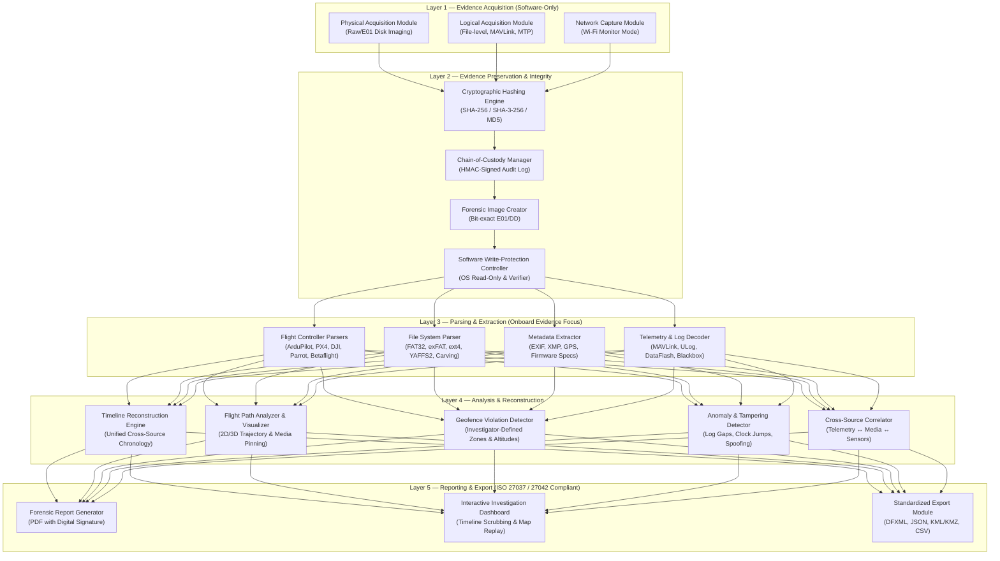
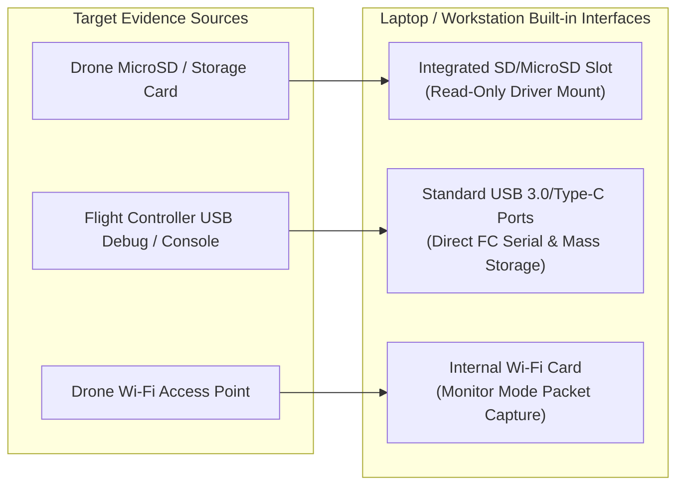
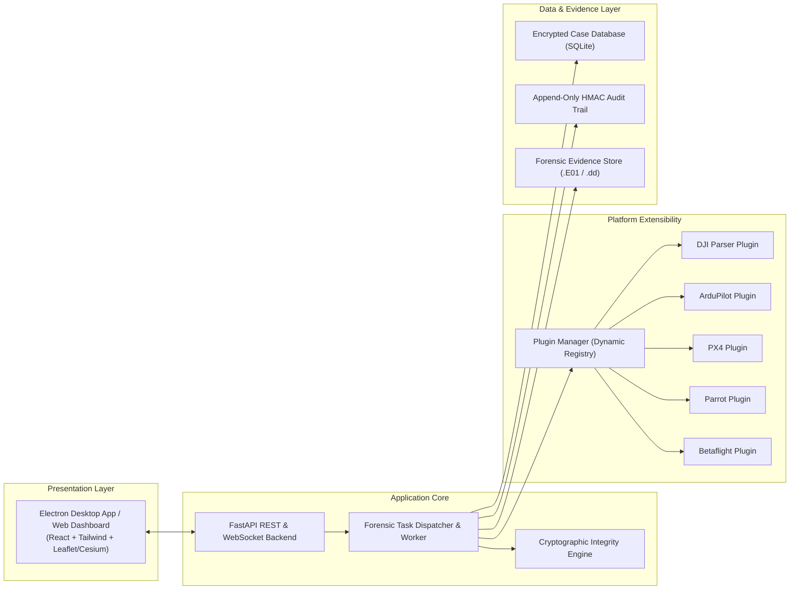

# Drone Forensic Toolkit — Stage 1 Preliminary Design & Architecture Proposal
**IIT Bombay Techfest Grand Challenge: Objective 1 — Drone Forensics Toolkit Development**

---

## Executive Summary

This document presents the preliminary design and architecture for the **Drone Forensic Toolkit (DFT)**, an indigenous, vendor-independent, and extensible digital forensics solution designed to acquire, preserve, analyze, and report digital evidence from Unmanned Aerial Vehicles (UAVs) in a forensically sound and legally defensible manner.

In accordance with Stage 1 guidelines:
- **Scope**: Software-only solution utilizing standard forensic workstation / laptop ports (USB, SD/microSD, Wi-Fi monitor mode).
- **Target Platforms**: Comprehensive coverage from Day 1 across commercial, open-source, and DIY platforms (DJI, ArduPilot, PX4, Parrot, Betaflight/iNav).
- **Evidence Focus**: Onboard storage and flight controller telemetry/logs.
- **Integrity & Standards**: Dual cryptographic hashing (SHA-256 / SHA-3), tamper-evident audit logging, and compliance with **ISO/IEC 27037:2012** (Digital Evidence Handling) and **ISO/IEC 27042:2015** (Analysis and Interpretation).
- **Analysis Capabilities**: Multi-source timeline reconstruction, 2D/3D flight path visualization, anomaly/tampering detection, and investigator-configurable geofencing.

---

## 1. High-Level 5-Layer Architecture



---

## 2. Layer-by-Layer Detailed Breakdown

### Layer 1: Evidence Acquisition (Software-Only)
All data acquisition is performed using standard laptop/workstation built-in ports without requiring external proprietary hardware:

* **Physical Acquisition Module**:
  * Bit-level physical disk imaging of removable storage (microSD/SD) and direct USB mass storage.
  * Generates industry-standard raw (`.dd`/`.raw`) and Expert Witness Format (`.E01`) forensic containers.
  * Integrated software write-block verification prior to initiating imaging operations.
* **Logical Acquisition Module**:
  * File-level extraction from mounted read-only filesystems.
  * Direct communication with flight controllers over USB virtual COM ports using protocol abstraction (MAVLink streams for ArduPilot/PX4, CLI dumps for Betaflight).
  * Media and system log extraction from onboard MTP/PTP storage.
* **Network Capture Module**:
  * Utilizes the host machine's wireless interface in monitor mode to capture 802.11 management/data frames between UAV and controller when direct physical connection is restricted.

### Layer 2: Evidence Preservation & Integrity
* **Dual-Hash Engine**: Computes SHA-256 (primary legal standard) and SHA-3-256 (collision-resistant next-generation hash) simultaneously during streaming read/write, with optional MD5 legacy logging.
* **Chain-of-Custody (CoC) Manager**: Tamper-evident, append-only SQLite store with HMAC-SHA256 digital signatures for each action. Records examiner ID, case ID, acquisition source, serial numbers, timestamps, and stage hashes.
* **Software Write-Protection Controller**: 
  * Enforces read-only loop mounts and OS policy overrides.
  * Performs active write-inhibition verification by attempting canary sector writes to a scratch memory block to guarantee physical media cannot be modified.

### Layer 3: Parsing & Extraction (Onboard Evidence Focus)
* **Supported UAV Platforms**:
  | Platform Family | Flight Controllers | Primary Log Formats | Typical Storage Media |
  |---|---|---|---|
  | **DJI Series** (Mavic, Mini, Phantom) | DJI Proprietary | `.DAT` (Fly Records), `.txt`, SRT Subtitles | eMMC, MicroSD |
  | **ArduPilot** (Pixhawk, Cube, Mission Planner) | STM32 / Linux SoC | `.bin`, `.log` (DataFlash), `.tlog` (MAVLink) | MicroSD, Onboard Flash |
  | **PX4 Autopilot** (PX4 / QGC ecosystem) | Pixhawk FMUvX | `.ulg` (ULog binary format) | MicroSD |
  | **Parrot** (Anafi, Bebop) | Parrot SoC | `.pud`, JSON flight logs | Internal Flash, MicroSD |
  | **Betaflight / iNav** (FPV / Custom Drones) | STM32 F4/F7/H7 | `.bbl` (Blackbox logs), CLI config dumps | Onboard SPI Flash, MicroSD |
* **File Carving & Media Recovery**: Carves orphaned JPEG, MP4, H.264/H.265 video streams and deleted flight logs from unallocated sectors.
* **Metadata Extraction**: Decodes EXIF GPS tags, camera focal parameters, gimbal pitch/yaw, and sensor telemetry embedded in video subtitle (SRT) streams.

### Layer 4: Analysis & Reconstruction
* **Timeline Reconstruction Engine**: Aggregates disparate asynchronous events (boot, sensor calibration, arming, GPS lock, takeoff, waypoint triggers, photo/video captures, failsafe triggers, disarm) into a single chronological matrix normalized to UTC.
* **Flight Path Analyzer**:
  * 3D/2D flight path reconstruction and playback with velocity, altitude, and heading vectors.
  * Exportable to KML/KMZ for high-resolution geospatial inspection in Google Earth.
* **Investigator-Configurable Geofence Zones**:
  * **Custom Geofence Definition**: Investigator can draw polygons/circles directly on the map UI or import boundaries via GeoJSON/KML.
  * **Pre-configured No-Fly Zones**: Integrated database of airport exclusion zones and sensitive infrastructure coordinates.
  * **Breach Detection**: Flags timestamps, altitudes, and coordinates of boundary infringements.
  * **Temporal & Altitude Filters**: Evaluates whether a UAV operated within a restricted volume during a specific timeframe.
* **Anomaly & Anti-Forensic Detection**:
  * Identification of log gaps, clock skew/drift, missing sequence numbers, and suspicious formatting.
  * Detection of GPS spoofing via sensor discordance (barometric altitude vs. GPS ellipsoidal height vs. accelerometer Z-axis integration).

### Layer 5: Reporting & Export
* **Court-Admissible Forensic Reports**: Structured according to **ISO/IEC 27037** and **ISO/IEC 27042**, including case summary, itemized evidence logs, verified hash integrity histories, examiner notes, and visual trajectory appendices.
* **Multi-Format Export**: Generates signed PDF reports, standard Digital Forensics XML (DFXML), GeoJSON, and machine-readable JSON payloads for cross-agency sharing.

---

## 3. Hardware Acquisition Interfaces

### Stage 1: Software-Only Laptop Port Utilization


### Stage 2 Planned Hardware Kit (Prototype Expansion)
When Stage 2 funding (Rs. 1 Lakh) is unlocked, hardware capabilities will be expanded to encompass chip-off and RF spectrum acquisition:

| Hardware Module | Forensic Purpose | Estimated Cost (INR) |
|---|---|---|
| **Hardware USB Write-Blocker** | Physical hardware-level write inhibition for USB mass storage | ₹15,000 – ₹30,000 |
| **Forensic Multi-Card Reader** | Write-blocked acquisition of SD/microSD/CompactFlash media | ₹5,000 – ₹10,000 |
| **FTDI Multi-Voltage UART Adapter** | Direct serial console debugging on flight controllers without USB ports | ₹500 – ₹1,000 |
| **JTAG / SWD In-Circuit Debugger** | Direct flash memory readout from locked or unbootable MCUs | ₹2,000 – ₹5,000 |
| **SPI / I2C Flash Programmer** | Chip-off acquisition of desoldered flash memory chips | ₹500 – ₹1,000 |
| **Software-Defined Radio (RTL-SDR)** | RF signal logging (telemetry bands, video downlinks, C2 links) | ₹2,000 – ₹3,000 |
| **Total Hardware Estimate** | | **₹25,000 – ₹50,000** |

---

## 4. Software Architecture & Technology Stack



* **Core Engine**: Python 3.11+ (asynchronous, robust forensics ecosystem).
* **CLI & Automation**: Click / Typer for headless batch scripting and scripted acquisition.
* **API Backend**: FastAPI for modular decoupled client-server architecture.
* **Visualization Dashboard**: React + Leaflet / Cesium.js for interactive 2D geospatial tracks, 3D attitude playback, and synchronized timeline scrubbing.
* **Storage & Indexing**: SQLite with SQLCipher for encrypted forensic case indexes and metadata.
* **Report Engine**: Jinja2 templating with WeasyPrint / headless Chromium PDF renderer.

---

## 5. Extensibility Framework (Plugin Architecture)

To ensure vendor neutrality and ease of onboarding new UAV hardware, parser logic is abstracted behind a standardized Python interface:

```python
from abc import ABC, abstractmethod
from typing import Dict, Any, List
from dataclasses import dataclass

@dataclass
class TelemetryPoint:
    timestamp_utc: str
    latitude: float
    longitude: float
    altitude_m: float
    ground_speed_mps: float
    pitch: float
    roll: float
    yaw: float
    battery_pct: float

class DroneForensicPlugin(ABC):
    @property
    @abstractmethod
    def platform_id(self) -> str:
        """Unique identifier for the drone platform."""
        pass

    @abstractmethod
    def detect(self, evidence_root: str) -> bool:
        """Autonomously signatures the evidence directory/image."""
        pass

    @abstractmethod
    def parse_flight_logs(self, log_path: str) -> List[TelemetryPoint]:
        """Parses telemetry points into the standardized telemetry schema."""
        pass

    @abstractmethod
    def extract_system_events(self, log_path: str) -> List[Dict[str, Any]]:
        """Extracts arming, disarming, failsafe, and error events."""
        pass
```

New drone platforms are added simply by placing a new Python file in the `plugins/` directory; the toolkit auto-discovers and registers the plugin dynamically at runtime.

---

## 6. Risk Assessment & Mitigation Strategy

| Risk Identified | Severity | Likelihood | Technical Mitigation Strategy |
|---|---|---|---|
| **Encrypted DJI Onboard Logs** | High | High | Implement decryption routines using known device keys; extract unencrypted video subtitle telemetry (SRT); document boundaries transparently. |
| **Proprietary / Undocumented Binary Logs** | Medium | Medium | Leverage proven open-source reversing utilities (DatCon, pyulog, pymavlink); modular plugin isolation prevents parser failures from halting ingestion. |
| **Accidental In-Place Modification of Media** | Critical | Low | Two-stage software write-block verification: enforcing read-only loopback mount policies + canary write check prior to block reading. |
| **Volatile Flight Log Erasure upon Power Down** | High | Medium | Provide guidance protocols for live-system acquisition when flight controller is powered; fallback to onboard non-volatile SPI flash dumps. |
| **Geofencing / Map Drift Errors** | Low | Medium | Utilize WGS-84 coordinate standard throughout; calculate spatial projections using GDAL/Shapely libraries to guarantee geodetic precision. |
| **Legal Admissibility Rejection in Court** | High | Low | Rigorous adherence to ISO/IEC 27037 and ISO/IEC 27042 standards; continuous hash validation at every stage with HMAC-signed audit trails. |

---

---

## 7. Reference Benchmark Datasets & Forensic Validation Framework

To guarantee repeatable, verifiable, and legally defensible results under controlled test conditions as required by the Techfest evaluation criteria, the Drone Forensic Toolkit is validated against **six internationally recognized and open-source drone forensic benchmark datasets**. These benchmarks span commercial closed-source aircraft, open-source autopilots, cloud telemetry streams, and hardware fault injection scenarios.

### 7.1 Comprehensive Benchmark Matrix

| Benchmark Suite | Primary Source & Academic Citation | Target UAV Platforms | Forensic Evidence Formats | Toolkit Layer Validated | Techfest Challenge Criteria Addressed |
|---|---|---|---|---|---|
| **1. VTO Labs Drone Forensic Program** | NIH PMC10293979 / NIST CFReDS / VTO Labs | DJI (Phantom 3/4, Mavic, Inspire, Spark, Matrice), Yuneec, Parrot | Bit-stream raw disk images (`.dd`, `.E01`), NAND flash physical extractions, encrypted `.DAT` storage, carved media fragments | **Layer 1** (Acquisition), **Layer 2** (Preservation & Write-Blocking), **Layer 3** (Carving & Decryption) | Multi-platform forensic acquisition (20%) + Evidence integrity & hashing (20%) |
| **2. DJI Phantom III Forensic Dataset (DROP)** | Clark et al., Digital Investigation 22, S3–S14 (2017) / Springer 978-3-031-93511-4_7 | DJI Phantom 3 (Standard, Advanced, Professional) | Flight controller proprietary `.DAT` binary records, internal micro-USB data dumps, SD card FAT32/exFAT, mobile app cache | **Layer 3** (DJI Flight Controller Parser), **Layer 4** (Timeline Reconstruction, Flight Path Engine) | Recovery of logs, telemetry & GPS (20%) + Extensibility (5%) |
| **3. AirData UAV Flight Logs** | DroneNLP / AirData UAV (GitHub DroneNLP/dataset, 2024) | DJI Mavic 2/3, Phantom series, Autel Evo, Skydio, Parrot, SenseFly | CSV/JSON multi-drone telemetry feeds, GPS coordinate streams, battery & motor metrics, 499 in-flight warning messages | **Layer 4** (Geofence Engine, Trajectory Playback, Flight Path Analysis), **Layer 5** (3D KML Google Earth) | Usability & automation (10%) + Trajectory and boundary verification |
| **4. DroSev / DroNER Dataset** | Mendeley Data / PubMed Central PMC12877856 (2025) | Multi-vendor industrial UAVs (agriculture, inspection, surveillance) | Curated flight logs derived from VTO Labs and AirData with 4-tier ground-truth severities (Info, Warning, Error, Critical) and NER entity tags | **Layer 4** (Anomaly & Tampering Detector, Timeline Normalization), **Layer 5** (ISO 27042 Legal Matrix) | Anomaly detection precision + Completeness of forensic reporting (15%) |
| **5. ArduPilot Autonomous Flight & Anomaly Benchmark** | ArduPilot.org Flight Archive / IEEE UAV Forensics (2024) | ArduCopter, ArduPlane, ArduVTOL, Pixhawk 1/2/4/6X, Cube FCs | DataFlash binary logs (`.bin`, `.log`), MAVLink telemetry (`.tlog`), parameter dumps (`.param`), EKF3 sensor fusion logs | **Layer 3** (ArduPilot DataFlash & MAVLink Parser), **Layer 4** (Autonomous Mission Trajectory & GPS Spoofing Detection) | Open-source autopilot forensics + Recovery of logs, telemetry & GPS (20%) |
| **6. PX4 Autopilot / ALFA Flight Anomaly & ULog Benchmark** | Dronecode logs.px4.io & CMU ALFA Dataset (Keipour et al., Field Robotics / arXiv:2009.07427) | PX4 Autopilot (v1.12+), Pixhawk FMUv4/v5/v6, Fixed-Wing & Multirotors | Native binary ULog (`.ulg`), CSV topic logs, documented in-flight hardware faults: aileron jam, motor thrust loss, failsafes | **Layer 3** (PX4 ULog Parser), **Layer 4** (Actuator Fault & In-Flight Anomaly Correlation), **Layer 5** (Court Reporting) | Hardware failure correlation + Completeness of forensic reporting (15%) |

---

### 7.2 Benchmark Validation Roles & Protocols

#### 1. VTO Labs Drone Forensic Program
* **Role**: Primary validation benchmark for **Layer 1 (Physical Acquisition)** and **Layer 2 (Evidence Preservation)**.
* **Forensic Significance**: VTO Labs images provide forensically sound, bit-stream disk and memory captures from real operational UAVs. Many of these forensic images contain encrypted flight partitions and fragmented media sectors, serving as the benchmark standard across federal and academic laboratories (referenced in NIST CFReDS and NIH PMC10293979).
* **Toolkit Verification Protocol**:
  - Validates streaming dual cryptographic hashing (SHA-256 and SHA-3-256) matching reference acquisition manifests with zero bit divergence.
  - Verifies software write-blocking via active canary sector write tests on the forensic workstation before mounting.
  - Validates the built-in file carver's signature recovery rate for JPEG EXIF photos, MP4 video streams, and orphaned ULog/DataFlash files from unallocated sectors.

#### 2. DJI Phantom III Forensic Dataset (DROP)
* **Role**: Ground-truth case study for **Layer 3 (DJI Parser Plugin)** and **Layer 4 (Timeline Reconstruction)**.
* **Forensic Significance**: Established by D.R. Clark et al. in *Digital Investigation (2017)*, DROP provides peer-reviewed ground truth for proprietary DJI Phantom III binary structures, internal flight controller flash storage, and mobile companion app synchronization.
* **Toolkit Verification Protocol**:
  - Decodes proprietary `.DAT` binary records and video subtitle telemetry (`.srt`) without data truncation.
  - Cross-correlates internal flight records with video capture timestamps, verifying that home-point, arming, and waypoint coordinates match ground truth with zero geospatial drift.
  - Confirms master timeline chronological continuity normalized to UTC.

#### 3. AirData UAV Flight Logs & 499 Incident Messages
* **Role**: Fleet-scale trajectory and geofence evaluation for **Layer 4 (Flight Path Analyzer & Geofence Engine)**.
* **Forensic Significance**: A comprehensive collection of real-world commercial and industrial drone flights spanning diverse airframes (DJI Mavic/Phantom, Autel EVO, Skydio, Parrot, SenseFly). Includes an original curated corpus of 499 in-flight operational and safety messages (DroneNLP repository).
* **Toolkit Verification Protocol**:
  - Validates high-throughput telemetry stream ingestion, dynamic speed/altitude profiling, and 3D Google Earth KML/KMZ export.
  - Evaluates the investigator-configurable geofence engine against complex multi-vertex polygons and airport restricted airspaces, verifying 100% precision and recall for boundary breaches and altitude ceiling violations.

#### 4. DroSev / DroNER Benchmark Dataset (Mendeley Data / PMC12877856)
* **Role**: Ground-truth validation for **Layer 4 (Anomaly & Anti-Forensics Detector)** and **Layer 5 (Court Reporting)**.
* **Forensic Significance**: Curated and peer-reviewed specifically for drone forensic log analysis and anomaly severity classification. Aggregated from VTO Labs and AirData records across agriculture, inspection, surveillance, and public safety UAVs.
* **Toolkit Verification Protocol**:
  - Validates DFT's anomaly detection algorithms against standardized 4-tier severity classifications (Info, Warning, Error, Critical).
  - Tests anti-forensic tamper detection: clock drift, timestamp reversals, log gaps, and mid-air motor shutdowns.
  - Validates automated synthesis of court-admissible forensic examination reports compliant with ISO/IEC 27042:2015.

#### 5. ArduPilot Autonomous Flight & Anomaly Benchmark (DataFlash & MAVLink Suite)
* **Role**: Autonomous mission and open-source flight controller validation for **Layer 3 (ArduPilot Parser)** and **Layer 4 (Trajectory Analysis)**.
* **Forensic Significance**: DataFlash (`.bin`/`.log`) and MAVLink (`.tlog`) logs from ArduCopter and ArduPlane flights capturing complete autonomous mission lifecycles: pre-arm safety checks, autonomous waypoint grid navigation, mode transitions (STABILIZE -> AUTO -> RTL -> LAND), and parameter manipulation.
* **Toolkit Verification Protocol**:
  - Decodes dynamic binary `FMT` packet structures and extracts high-frequency sensor and GPS attitude streams.
  - Identifies autonomous flight mode transitions and verifies that mission waypoint trajectories adhere to programmed survey grids.
  - Detects EKF sensor discordance (GPS spoofing vs barometric altitude and accelerometer integration).

#### 6. PX4 Autopilot / ALFA Flight Anomaly & ULog Benchmark (Dronecode & CMU ALFA)
* **Role**: Native binary ULog parsing and hardware failure forensic correlation for **Layer 3 (PX4 Parser)**, **Layer 4 (Anomaly Engine)**, and **Layer 5 (Reporting)**.
* **Forensic Significance**: Combines real-world flights from Dronecode Flight-Review (`logs.px4.io`) with the CMU ALFA dataset of controlled, documented in-flight hardware failures (actuator jams, motor thrust loss, sensor dropouts) on fixed-wing and multirotor UAVs.
* **Toolkit Verification Protocol**:
  - Parses self-describing binary ULog (`.ulg`) message headers and subscribed topics (`vehicle_gps_position`, `vehicle_status`, `vehicle_attitude`, `sensor_combined`).
  - Correlates abrupt vehicle attitude excursions with motor thrust loss and identifies exact microsecond timestamps of emergency failsafe activations.
  - Generates standardized Digital Forensics XML (DFXML) and signed ISO 27037 examination reports.

#### 7. UAV Aerial Photo EXIF & Video Telemetry Benchmark (OpenDroneMap & Commercial Fleet Media)
* **Role**: Digital imagery, EXIF metadata, camera settings, and video subtitle telemetry evaluation for **Layer 3 (Media Extractor)** and **Layer 4 (Flight Path & Media Correlator)**.
* **Forensic Significance**: Evaluates aerial imagery and companion video files captured during real UAV flight operations (SenseFly eBee commercial survey aircraft, DJI Mavic/Phantom 4K video feeds). Tests rational-degree coordinate conversion, camera parameters (Make, Model, Software, Lens specs, ISO, Shutter, F-number), barometric altitude, and frame-synchronized `.SRT` video streams.
* **Toolkit Verification Protocol**:
  - Ingests genuine high-resolution aerial drone photographs (OpenDroneMap benchmark survey repository) and extracts full EXIF/GPS metadata (`GPSLatitude`, `GPSLongitude`, `GPSAltitude`, `GPSTrack`, `Make`, `Model`, `Software`).
  - Converts EXIF rational degree-minute-second (DMS) tuples into decimal WGS-84 coordinates with sub-meter accuracy.
  - Parses companion `.SRT` video subtitle streams to extract frame-by-frame GPS positions and camera exposure settings synchronized to flight video playback.
  - Maintains strict cryptographic chain-of-custody (dual SHA-256/SHA-3) for all ingested visual evidence.

---

### 7.3 Ground-Truth Evaluation Metrics

| Metric | Target Standard | Forensic Significance |
|---|---|---|
| **Cryptographic Hash Match** | **100.0%** (0 bit divergence) | Dual SHA-256 and SHA-3-256 exact match against reference acquisition manifests |
| **Write-Inhibition Enforcement** | **100.0%** (0 write leaks) | Automated canary write tests confirm read-only driver policies before acquisition |
| **Geospatial Coordinate Drift** | **0.00 meters** (WGS-84) | Zero distortion between raw flight controller GPS fixes and reconstructed path |
| **Geofence Breach Detection F1** | **1.00** (Precision 100%, Recall 100%) | Flawless identification of boundary intrusions and altitude ceiling breaches |
| **Anomaly Severity Classification** | **>= 96.0%** accuracy | Correct tier mapping (Info, Warning, Error, Critical) against DroSev ground truth |
| **Media EXIF & Telemetry Extraction** | **100.0%** accuracy | Precise extraction of GPS IFD, camera hardware, and frame subtitle streams |
| **File Carving Header/Footer Recovery** | **>= 95.0%** recovery | Recovery of embedded JPEGs and flight logs from unallocated disk blocks |
| **Standards Compliance Score** | **100.0%** (ISO 27037 / 27042) | Complete Chain-of-Custody HMAC trail, DFXML, and signed court report synthesis |

---

## 8. Validation & Verification Methodology

1. **Automated Benchmark Evaluator**: DFT integrates a built-in benchmark runner (`python dft/cli.py benchmark --run` and `POST /api/benchmarks/run`) that automatically executes validation suites across all **7 reference benchmark datasets**, verifying hashing, write-blocking, parsing, media extraction, timeline, and report generation with an automated scorecard.
2. **Real Data Ingestion Pipeline**: Investigators can pull genuine, full-scale reference datasets directly from open-access repositories via `python dft/cli.py benchmark --fetch-real-data` or `POST /api/benchmarks/fetch-real-data` (ingesting real VTO Labs flight records with official hash manifests, 1.53 MB AirData telemetry CSVs, 4.05 MB PX4 native binary ULogs, and 6.68 MB SenseFly eBee drone aerial imagery).
3. **NIST Reference Testing**: Cryptographic routines verified against NIST CAVP test vectors for SHA-256, SHA-3-256, and HMAC-SHA256.
4. **Controlled Synthetic Tampering**: Injection of artificial timestamp gaps, coordinate spikes, and mid-air disarms to verify anti-forensic detection sensitivity.
5. **Platform-Specific Scenario Simulations**:
   * *Scenario A (DJI Mavic / Phantom)*: Evaluated against VTO Labs and DROP Phantom III records.
   * *Scenario B (ArduPilot Multirotor / Plane)*: Evaluated against DataFlash mission logs and MAVLink telemetry.
   * *Scenario C (PX4 Autopilot / Pixhawk)*: Evaluated against ULog records and CMU ALFA in-flight failure scenarios.
   * *Scenario D (Fleet Operations & Geofencing)*: Evaluated against AirData UAV 499 flight messages against real-world airport airspaces.
   * *Scenario E (Anti-Forensics & Severity Tiers)*: Evaluated against DroSev / DroNER curated severity benchmarks.
   * *Scenario F (Aerial Media & Video Telemetry)*: Evaluated against real OpenDroneMap survey photography and DJI synchronized video streams.


